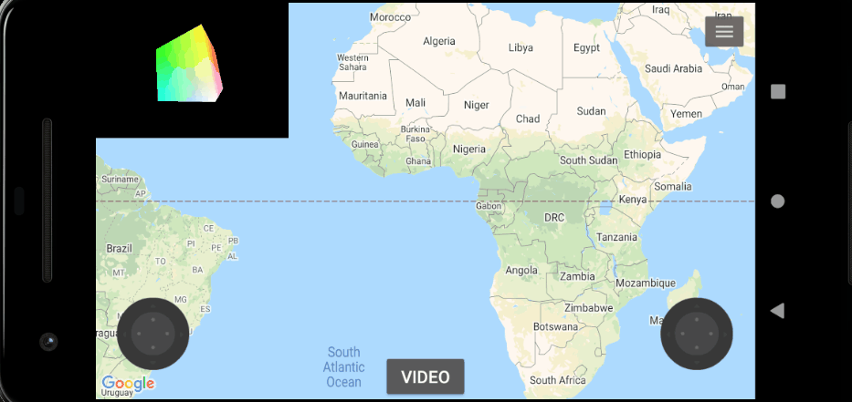

# vehicle-control
>Android application that sends control commands to the robot

## Demo

#### Map capabilities
>add,delete,drag marker and draw line between markers

#### Cube which changes position when device rotates

